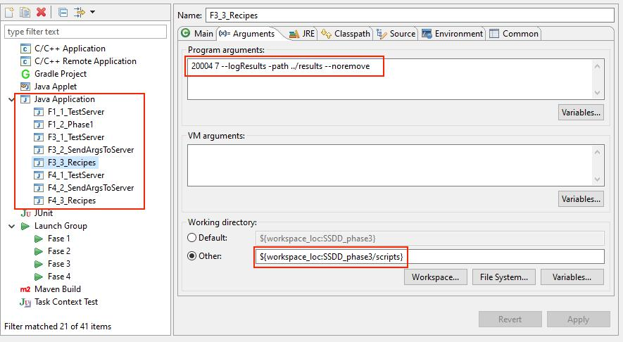
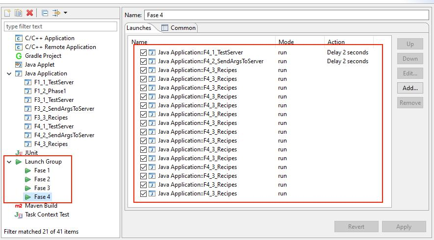
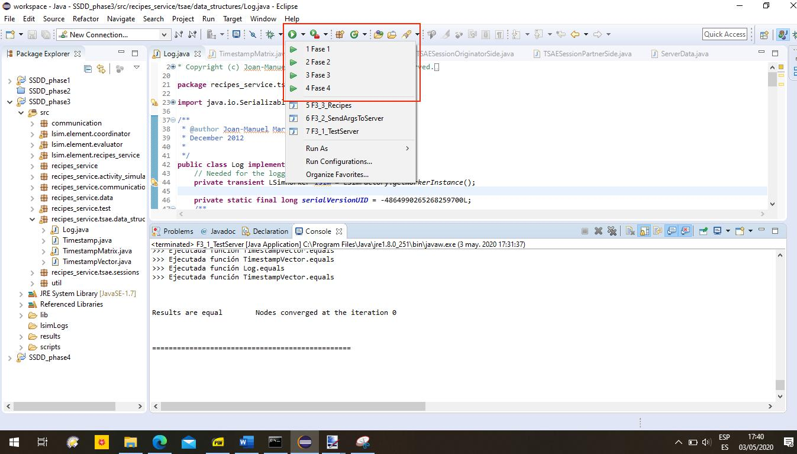

# UOC SSDD - TSAE PROTOCOL EXERCISE

This is the solution for the TSAE exercise that was proposed back when I was getting a Technical Engineering Systems degree in the UOC. It consisted on implementing several classes from the TSAE protocol, so a set of nodes would be able to exchange information and keep it synced, even though the implementation simulates random failures in the communications.

## The TSAE protocol
The exercise consists in completing a Java implementation of Golding's Timestamped Anti-Entropy Protocol (TSAE), a weak-consistency replication protocol designed for distributed internet applications, such as distributed databases, that predates other similar protocols like Bayou.

For further insight on this protocol, you can read the original Golding's thesis ["Weak-consistency group communication and membership"](http://www.cs.cornell.edu/courses/cs734/2000FA/cached%20papers/golding-thesis.PDF)

## Phases
* Phase 1 (up to a grade of D): Implementation and testing of Log and TimestampVector data structures
* Phase 2 (up to a grade of C-): Implementation of a reduced version of the application and TSAE protocol:
only add operation; no purge of log
* Phase 3 (up to a grade of C+): Extension of phase 2 to purge log with unsynchronized clocks
* Phase 4 (up to a grade of B): Evaluation of TSAE protocol and implementation of Remove recipe operation
* Phase 4.1 (up to a grade of A): Extend application adding the remove recipe operation
* Phase 4.2 (up to a grade of A with honors): Evaluation of TSAE protocol

## Setup
While the original exercise was meant to be run under Linux (only a shell script was provided), I've adapted the project to be ru under Windows. This exercise was completed using Eclipse IDE under Windows 10 v1909. The applications used are:
* Java JDK 1.8.0_251-b08, 64-bits.
* Eclipse Neon 3 v4.6.3, Java Developers edition.
* “C/C++ Remote (over TCF/TE) Run/Debug Launcher” Eclipse plugin, ver. 1.4.0.

Eclipse is used for creating configurations for the components of each phase, with the required arguments:

The Remote plugin is used for managing the launch sequences for the components for each phases:

The launch sequences appear under the "Run" menu. The main advantage of using Eclipse, instead of directly running the script from the command prompt, is that the code can be paused and easily debugged.

There's a full copy of the Eclipse workspace inside the Phase 4.1 folder.